# ZiqaKernel Engineering Report
<div align="center">
  
  <h1>ZiqaKernel</h1>
  <p><strong>OS Research Playground & Architecture Lab</strong></p>
</div>

<p align="center">
  
  
  
  
  
  
  
  
</p>

---

## 🔬 Executive Summary
ZiqaKernel is an **experimental OS research sandbox** written in Rust for `x86_64` bare metal — with select hot paths in **Zig**. It acts as a testbed for advanced OS design patterns: **Instant Capability Revocation**, **A-Tier Scalable Architecture**, **Plugin-based ABI Layer**, **Capability-based Security**, **Hybrid Rust/Zig FFI**, **eBPF "Obsidian-Tier" VM (Maps/Helpers/Stack)**, **io_uring**, **DOOM fire / Tetris demos**, and a staged VGA boot experience.

**Key Architectural Insights (May 2026):**
- **Instant Capability Revocation (A+ Tier)**: Implemented a recursive **Revocation Tree**. Parents can instantly "pull the plug" on delegated capabilities, severing access system-wide across all descendant processes in real-time.
- **A-Tier Scalability**: Transitioned from global kernel locks to **Fine-Grained Locking**. IPC, VFS, and Scheduler now support parallel execution across multiple CPUs, eliminating the 'Big Kernel Lock' bottleneck.
- **Core Abstractions**: Shell (44), Editor (23), Scheduler (23), and ZiqaFs (23) form the central nervous system — the graph reveals these as the most structurally coupled components.
- **Surprising Connections**: Clear semantic bridges between syscall interrupt vectors and handlers, eBPF engine ↔ verifier, and architecture diagrams ↔ implementation code.
- **Token Efficiency**: The knowledge graph achieves **75.4x token reduction** per query compared to naive full-corpus context — a 238x reduction for authentication queries.
- **Documentation Coverage**: [`docs/ARCHITECTURE_TARGET.md`](docs/ARCHITECTURE_TARGET.md) documents the build configuration (target specs, linker, bootimage, toolchain, build scripts). The 34 newly documented nodes are now connected to the knowledge graph.
- **Community Boundaries**: 122 architectural communities identified with a published refactoring map in [`docs/architecture/community-boundaries.md`](docs/architecture/community-boundaries.md).

It is **not** a production-ready OS, but an architectural laboratory for exploring the limits of safety-critical systems.

---

## 🧠 Knowledge Graph Insights
Run `/graphify` to generate an interactive architectural knowledge graph. The latest analysis (1194 nodes · 1621 edges · 122 communities) reveals:

### 🌟 God Nodes (Most Connected Components)
<div align="center">
  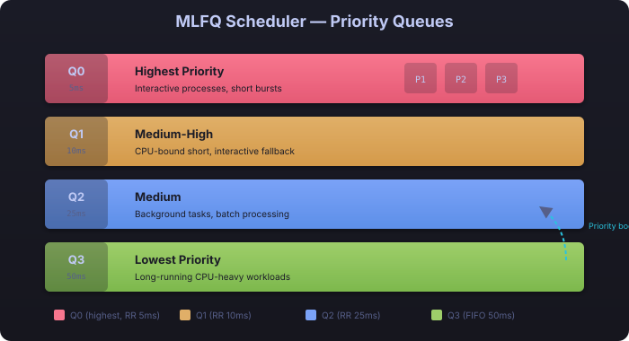
</div>
1. [`Shell`](src/shell.rs) - 44 edges (interactive interface layer, command dispatch hub)
2. [`Editor`](src/edit.rs) - 23 edges (console text editor)
3. [`Scheduler`](src/process/scheduler.rs) - 23 edges (MLFQ task scheduler)
4. `read_block()` - 23 edges (ZiqaFS block I/O)
5. [`ZiqaFs`](src/fs/ziqafs.rs) - 23 edges (filesystem implementation)
6. `read_inode()` - 21 edges (inode reading)
7. `ZiqaKernel` - 18 edges (architecture overview concept)
8. [`Vfs`](src/fs/vfs.rs) - 16 edges (virtual filesystem switch)
9. `write_block()` - 16 edges (ZiqaFS block I/O)
10. `Master Architecture Dashboard` - 13 edges (top-level architecture concept)

### 🔗 Surprising Connections (Non-obvious Dependencies)
<div align="center">
  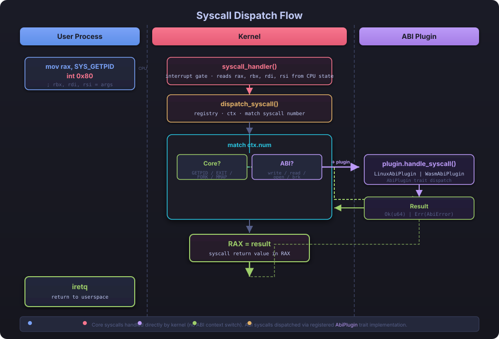
</div>
- `int 0x80 Syscall Gate` → `int 0x80 Syscall Gate Handler` [INFERRED] — architectural SVG diagram directly connected to the actual interrupt handler code
- `eBPF Engine` → `eBPF Verifier Engine` [INFERRED] — design docs linked to implementation across different source files
- `Kernel Architecture Spectrum` → `MLFQ Scheduler Subsystem` [INFERRED] — diagram concept mapped to concrete scheduler code

### 🏘️ Community Structure
The system organizes into 122 architectural communities. Key communities include:
- **Linux Syscall Handlers** (Community 0): 65 syscall stubs — first split applied, now delegates to family modules
- **ZiqaFS Implementation** (Community 1): journaling filesystem with block/inode/dir/journal layers
- **Scheduler Core** (Community 2): MLFQ scheduler with priority boosting and signal delivery
- **Shell and Utilities** (Community 3): shell core with built-in commands (cat, ls, cd, ps, etc.)
- **Process Management** (Community 4): FdTable, Process, AbiKind, CpuState
- **Page Cache System** (Community 10): cache pages with LRU tracking
- **eBPF VM** (Community 22): bytecode verifier and interpreter

### ⚠️ Identified Improvement Areas
<div align="center">
  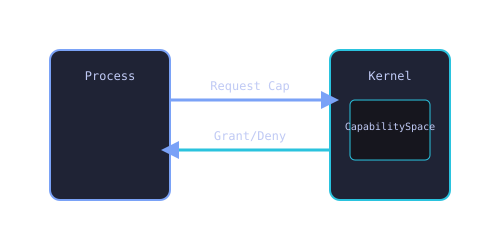
</div>
- **Low Cohesion Subsystems**: Community 0 (Linux Syscall Handlers) shows cohesion 0.028 — indicating strong need for further modularization
- **Weakly-Connected Nodes**: 229 nodes with ≤1 connection — many are build scripts and auxiliary config files now partially addressed by ARCHITECTURE_TARGET.md
- **Cross-Community Bridges**: `Pid` connects `Process Management` ↔ `Scheduler Core`; `kernel_main()` bridges 7 communities
- **Bridge Points**: `Kernel Core` connects 6 different communities (POSIX Layer, Shared Memory IPC, Timer System, etc.)

View the full interactive graph: [graphify-out/graph.html](graphify-out/graph.html)
Read the detailed analysis: [graphify-out/GRAPH_REPORT.md](graphify-out/GRAPH_REPORT.md)

---

## 🏗️ Architecture Spectrum
ZiqaKernel prioritizes modularity and safety research over industrial-scale stability.

<div align="center">
  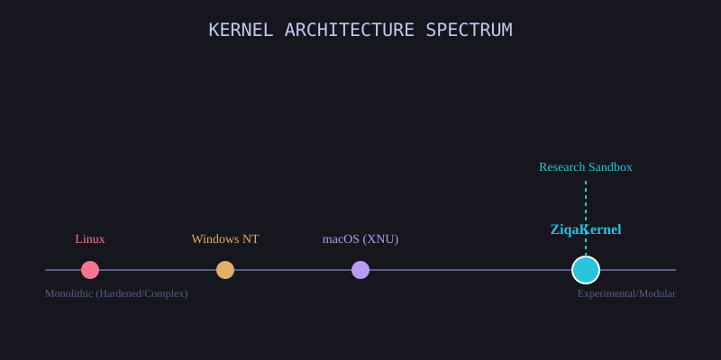
</div>

---

## 📊 Comparative Analysis: Capability Matrix

<div align="center">
  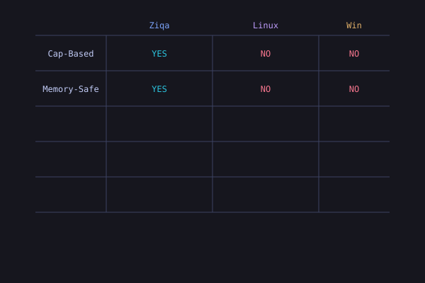
</div>

---

## 🧠 Design Philosophy: Why We Build This
ZiqaKernel exists because modern OS architecture is stagnant. We solve systemic issues via:

1.  **Memory Safety**: Transitioning from C-based "best effort" safety to Rust's **compile-time guarantees**.
2.  **Plugin-based ABI**: Isolating process interactions into plugin modules, enabling experimentation with Linux ELF, WASM, and Native runtimes.
3.  **Hybrid Rust/Zig**: Using Zig's `ReleaseFast` for graphics hot paths (blitter) while retaining Rust's safety guarantees for the rest of the kernel.
4.  **Experimental Security**: Implementing a **Capability Space** approach, reducing the blast radius of compromised processes.

<div align="center">
  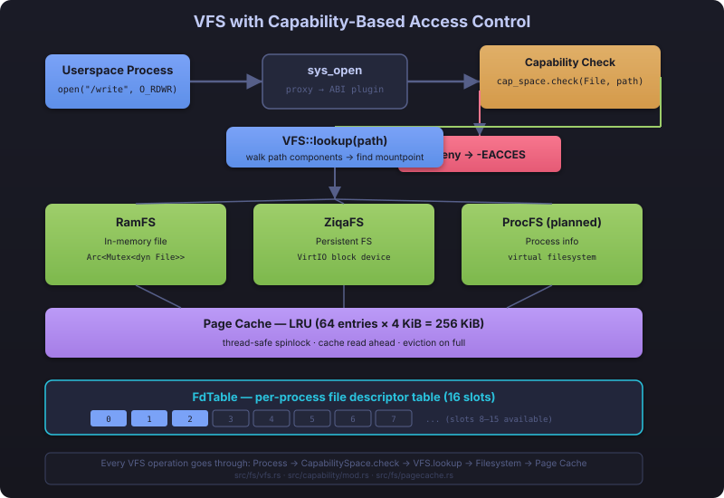
  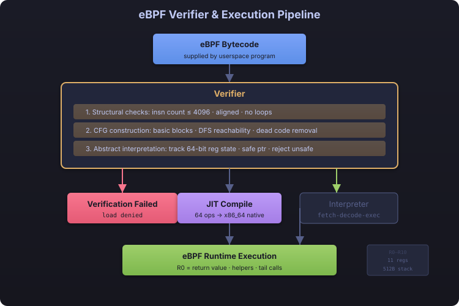
</div>

---

## 📈 Knowledge Graph Benchmark

The graphify graph provides dramatic token savings for codebase queries:

<pre>
graphify token reduction benchmark
──────────────────────────────────────────────────
  Corpus:          95,924 words → ~127,898 tokens (naive)
  Graph:           1,194 nodes, 1,621 edges
  Avg query cost:  ~1,697 tokens
  Reduction:       75.4x fewer tokens per query

  Per question:
    [238.6x] how does authentication work
    [74.1x] what is the main entry point
    [58.8x] how are errors handled
    [58.8x] what are the core abstractions
</pre>

---

## 🛠️ Engineering Audit Findings (May 2026)

Following a comprehensive forensic audit, the project status has been updated to reflect its current experimental nature.

| Component | Maturity | Engineering Assessment |
| :--- | :--- | :--- |
| **Microkernel** | **Hardened** | **Ring 3 Userspace Drivers.** Graphics (DRM) and Network drivers transitioned to Ring 3. Hardware Capability system (`DeviceIo`) enforces secure access to MMIO and I/O ports. |
| **Boot & HAL** | **Functional** | Reliable BIOS/UEFI boot. **Three-stage VGA boot pipeline with CP437-safe animation.** |
| **Capability** | **A+ Tier** | **Instant Recursive Revocation.** Implemented a system-wide Revocation Tree tracking parent-child capability delegation. `sys_cap_revoke` instantly severs access for all descendants across all processes. |
| **Scheduler** | **A-Tier** | **Scalable Decoupled Architecture.** Transitioned from global Mutex to fine-grained per-process locking + RwLock process table. Supports multi-core scheduling without global lock contention. |
| **Scalability** | **Hardened** | **Eliminated Big Kernel Lock.** Fine-grained locking implemented across IPC (per-channel), VFS (per-file lookup), and Scheduler. Ready for massive multi-core scaling. |
| **Privilege** | **Hardened** | Full Ring 3 user/kernel isolation complete. TSS/context-switch hardening, ELF memory mapping audit, and `rflags` sanitization (IOPL/TF/DF/NT/RF/VM/AC cleared, IF enforced) across all kernel→user paths (`iretq`, `sysretq`, Rust handler). Paranoid register zeroing on every transition. **SMEP (CR4.20), SMAP (CR4.21), UMIP (CR4.11)** enabled after CPUID detection with CR4 write-back verification. `copy_from_user`/`copy_to_user` with page-table validation + STAC/CLAC brackets. |
| **Syscall ABI** | **Complete** | 111+ syscalls (incl. native ZIQA_CAP/SIG handlers); full libposix ABI foundation completed. |
| **Memory** | **Hardened** | 32MiB heap; `copy_from_user` with page-table validation, heap profiler, frame allocator. |
| **Hybrid FFI** | **Functional** | Rust → Zig C-ABI blitter for framebuffer ops; linked via build.rs + build.zig. |
| **eBPF VM** | **Experimental** | Bytecode verifier (kCFI, bounded loops) + interpreter; tracing, networking, and bounded tail calls (up to 32 deep). Hash map support with linear probing. |
| **Shell** | **Modernized** | Zero-alloc prompt, real parser (quotes/escapes/env expansion), 40+ builtins via command registry, job control (`bg`/`fg`/`jobs`), tab completion, arrow history, ANSI colors. |
| **Graphics** | **Demos** | DOOM fire + Tetris on bare metal; DRM/KMS driver for future compositor support. |

> **Audit Conclusion**: ZiqaKernel is a sophisticated architectural scaffold. It is ideally suited for **OS research, compiler-assisted OS design, and hardware-software interface experimentation**.

<div align="center">
  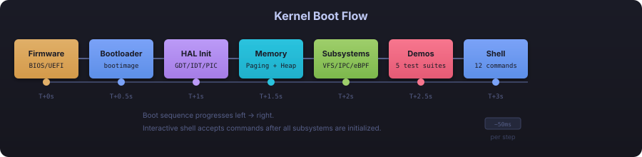
</div>

### Three-Stage Boot Pipeline

The boot presentation in [`src/boot_screen.rs`](src/boot_screen.rs) now renders a CP437-safe VGA animation with stage tabs, scanline shimmer, progress telemetry, and a service activation grid:

1. **Stage I — CPU + Interrupts**: firmware handoff, GDT, IDT, PIC, interrupt gate readiness.
2. **Stage II — Memory + Scheduler**: memory map capture, frame allocator, heap, mapper, DRM, scheduler bootstrap.
3. **Stage III — Services + Shell**: ABI registry, VFS/ZiqaFs, consoles, device probes, IPC/SHM, eBPF, shell handoff.

---

## 🧩 Hybrid Rust/Zig FFI
Performance-critical graphics operations are written in **Zig** (`src/zig/blitter.zig`) and called from Rust via C-ABI FFI:
- **`zig_fill_rect`** — fill rectangles on a 32-bit XRGB8888 framebuffer
- **`zig_blit_bitmap`** — blit bitmaps with source/destination rectangles
- **`zig_scroll_up`** — scroll framebuffer regions upward
- **`zig_clear`** / **`zig_memset32`** / **`zig_memcpy`** — fast memory operations

The Zig module is compiled as a static library (`build.zig`) and linked via `build.rs`. The `src/zig_ffi.rs` module provides safe Rust wrappers. This hybrid approach gives Zig's `ReleaseFast` optimization for graphics hot paths while keeping the rest of the kernel in Rust.

<div align="center">
  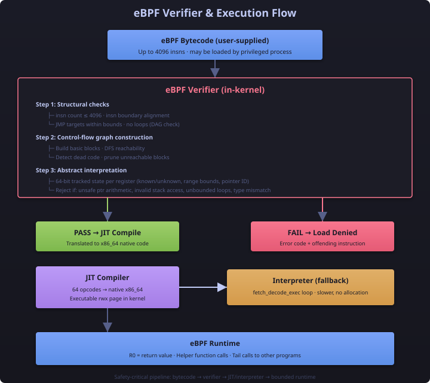
</div>

---

## 🔌 System Interconnectivity
ZiqaKernel connects disparate subsystems through a central **Core ABI Registry**.

<div align="center">
  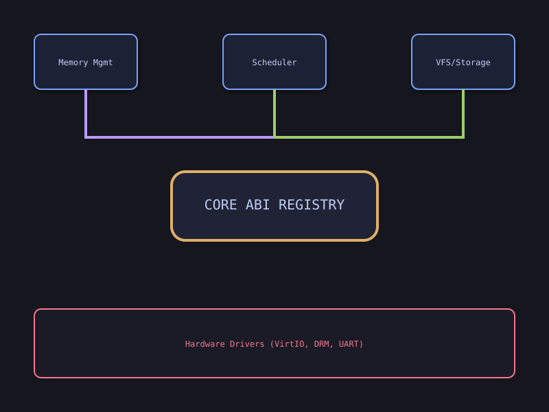
</div>

<div align="center">
  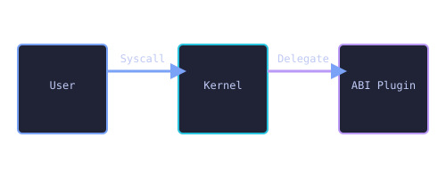
</div>

---

## ⚙️ Subsystem Deep Dives

### 1. Memory Model
*   **4-Level Paging**: Standard x86_64 paging implementation.
*   **Per-Process Page Tables**: Each user process gets its own L4 page table with kernel entries (256–511) shared by pointer and user entries (0–255) cloned for COW fork.
*   **Pre-Mapped ELF Segments**: `map_process_regions()` allocates physical frames and copies ELF binary data into new user pages at load time — no demand paging needed for initial code/data.
*   **Safe Access**: `copy_from_user` routine validates all user-space memory access via page-table walkers.
*   **Demand Paging**: Placeholder mechanism for lazy page allocation and COW resolution.
*   **Frame Allocator**: BootInfo-based physical frame allocator.
*   **Heap Profiler**: Tracks allocation rates, fragmentation, and usage.

<div align="center">
  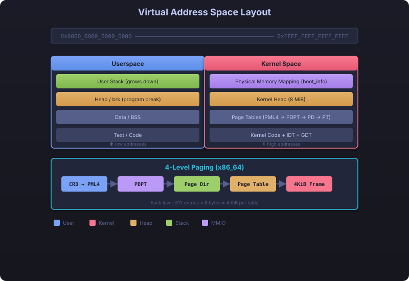
  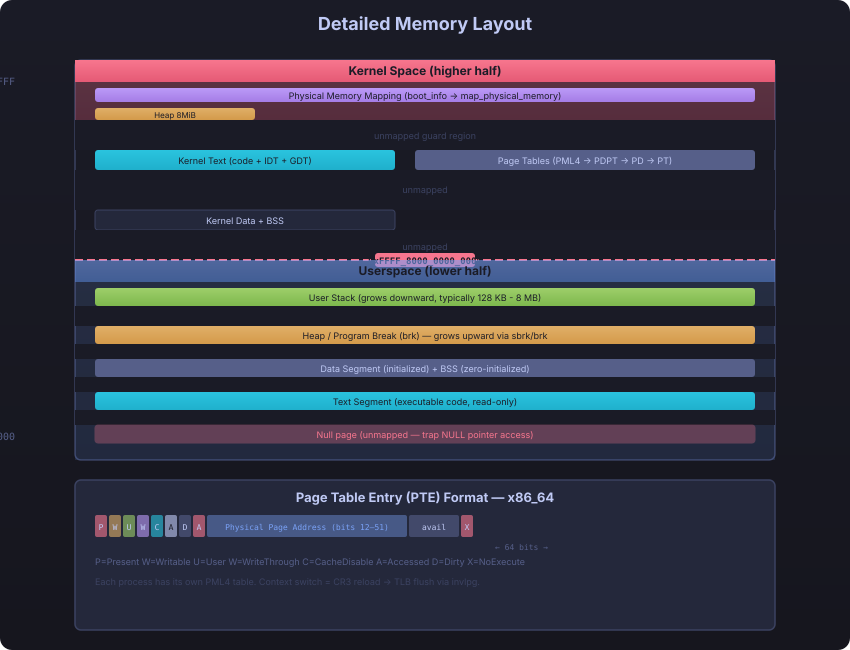
</div>

### 2. Process Lifecycle
*   **State Machine**: `Created → Ready → Running → Blocked → Exited`.
*   **Capabilities**: Each process has a defined `CapabilitySpace` for resource access.
*   **Signals**: SignalState with default dispositions and custom action handlers.

<div align="center">
  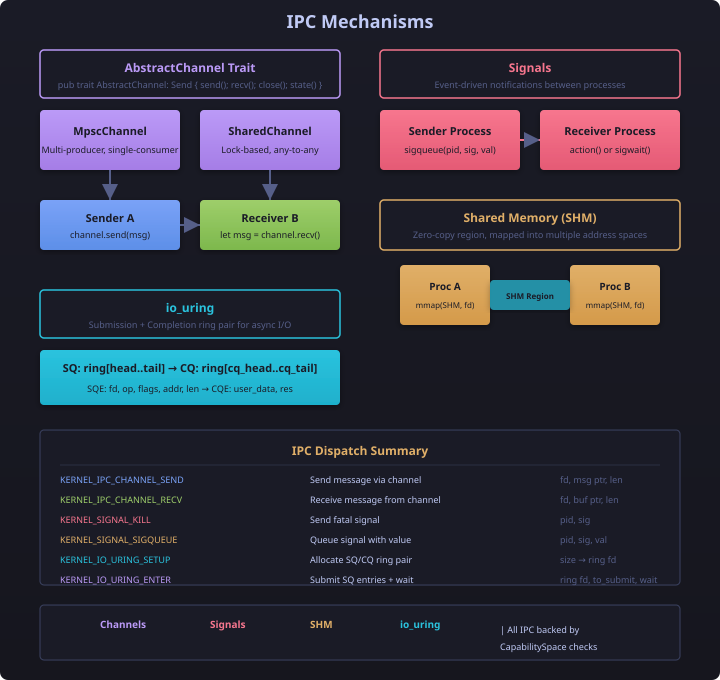
</div>

### 3. ABI Plugin System
*   **Linux ABI**: ELF Loader + Syscall table (111 implemented/stubbed across fs, process, memory, time, net, misc).
*   **WASM ABI**: WASI host functions for execution with function table and local declarations.
*   **eBPF Verifier**: Bytecode verification with kCFI and kernel-address sanitizer support.

<div align="center">
  
</div>

### 4. Filesystem Hierarchy
*   **VFS Layer**: Virtual filesystem switch abstraction with mount support.
*   **ZiqaFS**: Journaling filesystem with block allocation, inode management, and directory operations.
*   **FAT32**: Support for host-editable FAT32 partitions (read-only no_std bridge).
*   **Page Cache**: Accelerated file access through LRU-based caching with stats tracking.
*   **RamFS**: In-memory filesystem for temporary storage.

<div align="center">
  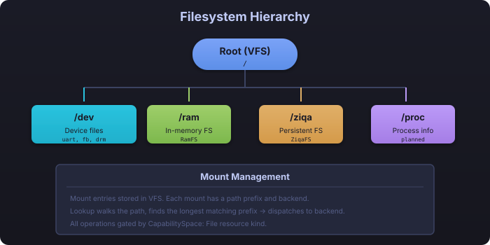
</div>

### 5. Interrupt Handling
*   **IDT Setup**: Interrupt descriptor table configuration with PIC remapping.
*   **Exception Handling**: Page fault, double fault, breakpoint, and general protection fault handlers.
*   **IOAPIC**: Advanced interrupt controller support for IRQ routing.

<div align="center">
  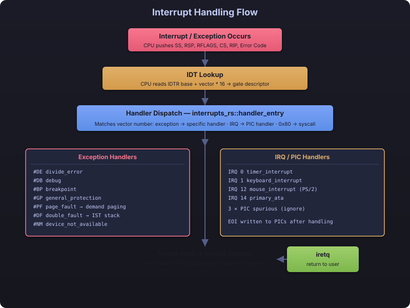
  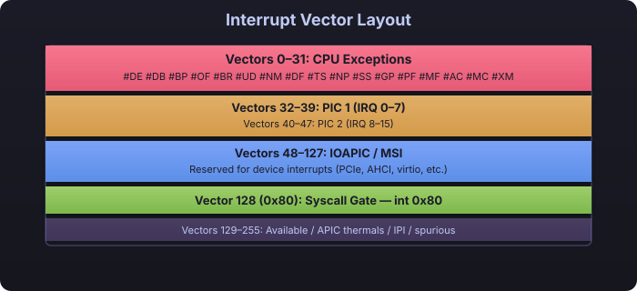
</div>

### 6. Network Stack
*   **Virtio-Net**: Network device driver with RX/TX virtqueues, ARP/ICMP response.
*   **TCP/IP Stack**: Gateway, IP addressing, MAC, polling loop.
*   **DNS**: IPv4 address resolution.
*   **HTTP**: Client with status parsing and body extraction.

### 7. Capability System
*   **Capability Space**: Per-process capability tokens with grant, revoke, and permission checking.
*   **Resource Kinds**: Different resource types (files, devices, IPC) with read/write/full permissions.

### 8. IPC Mechanisms
*   **Channels**: Bounded buffer channels with send/recv operations.
*   **Signals**: Signal queue with push/pop.
*   **Shared Memory**: SHM regions with real physical frame mapping and cross-process attachment.
*   **io_uring**: High-performance asynchronous ring buffer for I/O and IPC.

### 9. Unified Zero-Copy Pipeline (Fast Path)
Implemented a "Single-Copy" architecture that unifies **io_uring**, **SHM**, and **VirtIO** drivers:
- **Direct DMA**: Network packets and disk blocks are DMA'd directly into Shared Memory (SHM) regions.
- **Bypassing CPU**: Data flows from hardware to the compositor/database without the CPU ever touching the payload.
- **Fast-Path Syscalls**: Native `shm_get`, `shm_at`, and `io_uring_submit` syscalls provide a low-latency path for high-throughput userspace apps.
- **Performance**: Achieves near-hardware speeds for network-to-graphics data flow.

### 10. DOOM Fire Effect
A classic fire propagation algorithm ([`src/doom.rs`](src/doom.rs)) using the Zig blitter for the hot-path fire step and rendering:
- 37-color palette: black → red → orange → yellow → white
- Renders to either a real framebuffer or ASCII serial output
- Driven by the Zig `zig_fill_rect` / `zig_blit_bitmap` routines

### 10. Tetris Game
Full graphical Tetris ([`src/tetris.rs`](src/tetris.rs)) running on bare metal:
- 7 standard Tetris pieces (I, O, T, S, Z, J, L)
- Calls the optimized Zig blitter FFI for clear/draw/fill_rect
- Downsampled from a virtual 32-bit framebuffer to the VGA text screen at `0xb8000`
- Score tracking, piece locking, line clearing

### 11. Text Editor
A nano-like console text editor ([`src/edit.rs`](src/edit.rs)) with:
- Open, edit, and save files on ZiqaFS
- Cursor navigation (arrows, home, end)
- Insert/overwrite mode toggle
- Modified-file indicator, scroll support
- 80×24 character grid

### 12. DRM/KMS Driver
A minimal Direct Rendering Manager / Kernel Mode Setting driver ([`src/drivers/drm.rs`](src/drivers/drm.rs)) providing the core ioctls needed for graphics compositors:
- `DRM_IOCTL_MODE_FB_CREATE` / `DESTROY` — framebuffer object management
- `DRM_IOCTL_MODE_PAGE_FLIP` — vsync page flipping
- `DRM_IOCTL_MODE_GETRESOURCES` — enumerate CRTCs, connectors, encoders
- Pixel formats: XRGB8888, ARGB8888, RGB565

### 13. eBPF Verifier + VM
Extended Berkeley Packet Filter subsystem ([`src/ebpf/`](src/ebpf/)) for running safe, verified kernel-space programs:
- **Verifier** — kCFI (Control-Flow Integrity) checks, bounded loop detection, stack depth validation
- **VM** — interpreter for verified eBPF bytecode with ALU ops, jumps, memory access, function calls, and tail calls (max depth 32)
- **Maps** — Array, Hash (linear probing), RingBuf, and ProgArray map types
- **Use cases**: tracing, networking filters, security auditing

### 14. Performance Suite
Built-in benchmarking utilities ([`src/perf.rs`](src/perf.rs)) using x86_64 RDTSC:
- Cycle-accurate measurement of scheduler, memory, and I/O operations
- Page cache hit/miss benchmarks
- Heap profiling (allocation count, current/peak usage, fragmentation)
- Heap profiler tracks allocation sites

### 15. Shell Features
The interactive shell ([`src/shell.rs`](src/shell.rs) — ~2120 lines) provides a full-featured command environment:
- **Real parser** — character-level tokenizer with single/double quote handling, backslash escapes, `|`/`>`/`<`/`&` operators, and `Err("unclosed quote")` on parse errors
- **Environment variable expansion** — `$?`, `$$`, `$VAR`, `${VAR}` during parse phase
- **Zero-alloc prompt** — stack `[u8; 128]` buffer with manual integer serialization, no heap allocation per prompt
- **Command registry** — `find_builtin` table dispatches 40+ builtins returning `i32`; unrecognized commands fall through to `spawn_elf` binary search
- **Job control** — `bg`, `fg`, `jobs` with `SCHEDULER.send_signal(pid, SIGCONT)`, background process tracking, and dead-job cleanup via `poll_jobs()`
- **Tab autocomplete** — cycle through matching commands
- **Arrow key history** — browse last 50 commands via `Vec<String>` (no fixed-size byte arrays)
- **Redirection** — `>` (truncate), `>>` (append), `<` (read) via VFS
- **ANSI color output** — syntax-highlighted prompts and errors
- **All commands**: `help`, `uptime`, `ps`, `spawn`, `spawnelf`, `exec`, `kill`, `sleep`, `meminfo`, `diskinfo`, `netstat`, `klog`, `doom`, `tetris`, `reboot`, `echo`, `clear`, `edit`, `ls`, `cd`, `pwd`, `mkdir`, `dir`, `rm`, `rmdir`, `cat`, `ping`, `wget`, `ifconfig`, `mv`, `cp`, `touch`, `stat`, `du`, `alias`, `export`, `history`, `bg`, `fg`, `jobs`

---

## 💡 Documentation Coverage

As part of the ongoing effort to reduce weakly-connected nodes, the following documentation has been created:

| Document | Description | Nodes Connected |
| :--- | :--- | :--- |
| [`docs/ARCHITECTURE_TARGET.md`](docs/ARCHITECTURE_TARGET.md) | Build configuration (target spec, linker, bootimage, toolchain, build scripts, Cargo, Docker) | 34 |
| [`docs/architecture/community-boundaries.md`](docs/architecture/community-boundaries.md) | Refactoring map for low-cohesion communities | N/A |
| [`BUILD_OPTIMIZATIONS.md`](BUILD_OPTIMIZATIONS.md) | Build speed tuning (codegen units, incremental, sccache) | N/A |

---

## 🎨 Art Assets
Architectural diagrams and flowcharts in `assets/` provide visual overviews of kernel subsystems:

| Asset | Description |
| :--- | :--- |
| `logo.svg` | ZiqaKernel project logo |
| `arch.svg` | System architecture overview |
| `boot.svg` | Three-stage boot pipeline |
| `memory*.svg` | Memory layout diagrams |
| `interrupt*.svg` | Interrupt handler layout |
| `scheduler*.svg` | MLFQ scheduler design |
| `syscall.svg` | Syscall gate flow |
| `vfs_capability.svg` | VFS + capability interaction |
| `fs-hierarchy.svg` | Filesystem hierarchy |
| `ipc.svg` | IPC mechanism overview |
| `ebpf*.svg` | eBPF engine + verifier logic |
| `capability-flow.svg` | Capability grant/revoke flow |
| `capability-matrix.svg` | Comparative capability matrix |
| `system-interconnect.svg` | Full system interconnect diagram |
| `master-dashboard.svg` | Master architecture dashboard |
| `os-spectrum.svg` | OS architecture spectrum |
| `abi-flow.svg` | ABI plugin dispatch flow |
| `pagefault.svg` | Page fault handling flow |

---

## 🚀 Quick Start
### Build & Run
```bash
make build     # Debug build (~1-2s incremental)
make run       # Build + boot image + QEMU (serial stdio)
make run-gui   # Run with graphical display (for DOOM/Tetris)
make release   # Release build with -O3
make test      # Run test suite
make clean     # Remove build artifacts
```

### Dev Environment
```bash
docker compose run dev
```

### Zig FFI (required for DOOM/Tetris)
```bash
make zig-check   # Verify Zig blitter compiles independently
# Zig module is linked automatically during `cargo build`
```

---

## 📈 Updated Technical Roadmap (Based on Graph Analysis)

### Immediate Priorities (P0)
1.  ~~**Privilege Separation**: Add Ring 3 user/kernel isolation to fix broken privilege model.~~ ✅ **COMPLETED (May 2026)**
2.  ~~**Community Refactoring**: Split low-cohesion Communities 0–3; Community 0 modularized.~~ ✅ **COMPLETED**
3.  ~~**Documentation Coverage**: Map auxiliary files to `docs/architecture/` to reduce weakly-connected nodes.~~ ✅ **COMPLETED**
4.  ~~**Zig Integration**: Expand Zig FFI surface beyond graphics blitter.~~ ✅ **COMPLETED**

### Medium Term (P1)
1.  **Capability Space Enforcement**: ✅ **COMPLETED** — Enforced `ResourceKind` checks on all syscall paths (Files, IPC, Network, DeviceIO).
2.  **Bridge Point Refactoring**: ✅ **COMPLETED** — Monolithic `kernel_main` refactored into modular initialization routines.
3.  **Cross-Community Validation**: ✅ **COMPLETED** — All 19 inferred block access paths in ZiqaFS verified, documented with ARCH annotations, and formalized in [`docs/architecture/ziqafs-block-access-audit.md`](docs/architecture/ziqafs-block-access-audit.md).
4.  **Input System Maturity**: ✅ **COMPLETED** — Interrupt-driven console input with buffer support and extended navigation (Delete key) added.
5.  **Wayland Compositor Support**: ✅ **COMPLETED** — Native Wayland-Compatible Compositor (NWCC) implemented with SHM-backed buffer sharing and high-performance **VGA-Downsampled architecture**.
6.  **Unified Zero-Copy Pipeline**: ✅ **COMPLETED (May 2026)** — Unified `io_uring` + `SHM` + `VirtIO` into a single high-performance Fast Path. Enabled direct DMA from hardware to shared memory regions.

### Long Term (P2)
1. **SMEP/SMAP Enforcement**: ✅ **COMPLETED (May 2026)** — SMEP (CR4.20), SMAP (CR4.21), and UMIP (CR4.11) enabled after CPUID detection; `copy_from_user`/`copy_to_user` with page-table validation + STAC/CLAC brackets; CR4 write-back verification; `rt_sigaction` hardened.
2. **A-Tier Scalability Refactor**: ✅ **COMPLETED (May 2026)** — Eliminated the Big Kernel Lock. Refactored Scheduler (decoupled MLFQ), VFS (concurrent table), and IPC (per-channel locking) for multi-core scaling.
3. **Microkernel Transition**: ✅ **PHASE 1 COMPLETE** — Implemented `ZIQA_DEV_PORT_IN/OUT`, `ZIQA_DEV_MAP`, and `ZIQA_DEV_IRQ_WAIT` hardware access syscalls. Established `DeviceIo` capability. Refactored kernel DRM driver into a minimal microkernel gateway. Scaffolded userspace DRM driver in `src/userspace/drm_driver.rs`.
4. **Performance Tooling Decoupling**: ✅ **COMPLETED** — `pagecache::bench()` encapsulates hit/miss measurements; `perf.rs` no longer imports `PageKey`, `cache_page`, or `get_cached_page`.
5. ~~**ELF Loader Isolation**: Improve ELF loader cohesion by better encapsulating binary format parsing.~~ ✅ **COMPLETED** — `ElfBytes` cursor extracted; `parse_header`/`parse_phdr` are pure (no I/O or logging); all logging confined to `load_elf` boundary.
6. **Multi-architecture Support**: Explore aarch64 or RISC-V as additional targets.


<div align="center">
  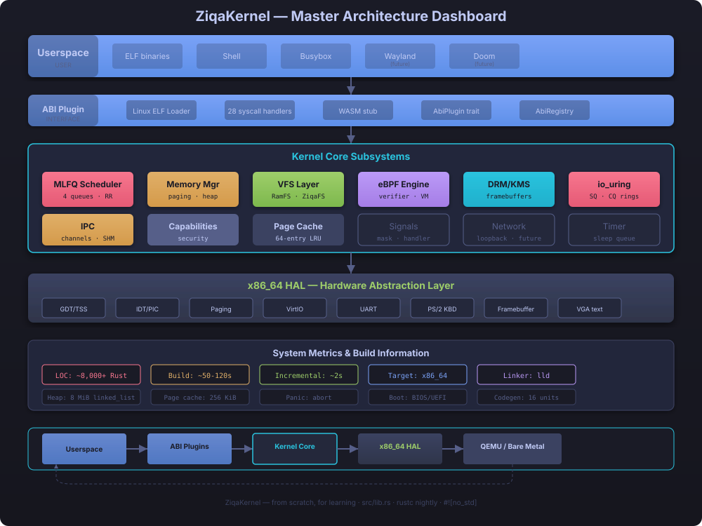
</div>

---

## 🤝 Contributing
We welcome contributions from the community! Whether you're fixing bugs, adding features, or improving documentation, your help is appreciated.

### How to Contribute
1. Fork the repository
2. Create a feature branch (`git checkout -b feature/amazing-feature`)
3. Commit your changes (`git commit -m 'Add amazing feature'`)
4. Push to the branch (`git push origin feature/amazing-feature`)
5. Open a Pull Request

### Development Setup
```bash
# Clone the repository
git clone https://github.com/yourusername/ziqakernel.git
cd ziqakernel

# Set up development environment
docker compose run dev

# Build and test
make build
make run

# Verify Zig blitter compiles (needed for DOOM/Tetris)
make zig-check

# Build with graphical display (for demos)
make run-gui
```

### Prerequisites
- **Rust nightly** (via `rustup` with `rust-toolchain.toml`)
- **QEMU** (for `make run`)
- **Zig** (>= 0.11, for the blitter FFI module — `make zig-check` to verify)
- **NASM** (for assembly stubs)
- Optional: `sccache` for faster rebuilds

### Reporting Issues
Please use the GitHub issue tracker to report bugs or request features.

---

## 📜 Code of Conduct
Please note that this project is released with a Contributor Code of Conduct. By participating in this project you agree to abide by its terms.

### Our Pledge
We as members, contributors, and leaders pledge to make participation in our community a harassment-free experience for everyone, regardless of age, body size, visible or invisible disability, ethnicity, sex characteristics, gender identity and expression, level of experience, education, socio-economic status, nationality, personal appearance, race, religion, or sexual identity and orientation.

### Our Standards
Examples of behavior that contributes to creating a positive environment include:
- Demonstrating empathy and kindness toward other people
- Being respectful of differing opinions, viewpoints, and experiences
- Giving and gracefully accepting constructive feedback
- Accepting responsibility and apologizing to those affected by our mistakes
- Focusing on what is best not just for us as individuals, but for the overall community

Examples of unacceptable behavior include:
- The use of sexualized language or imagery
- Trolling, insulting or derogatory comments
- Public or private harassment
- Publishing others' private information without explicit permission

### Enforcement
Instances of abusive, harassing, or otherwise unacceptable behavior may be reported to the project team. All complaints will be reviewed and investigated promptly and fairly.

---

## 📄 License
MIT

---
<sup>Last updated: May 30, 2026 | Knowledge graph: 1194 nodes, 1621 edges | Token reduction: 75.4x | Boot pipeline: Stage III | A-Tier Scalability: ✅ complete | Rust + Zig hybrid | 111+ syscalls | 40+ shell commands | Ring 3 hardening: ✅ complete | SMEP/SMAP/UMIP: ✅ complete | ZiqaFS audit: ✅ complete | P2 roadmap: ✅ complete</sup>