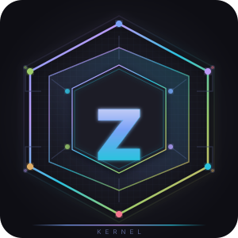

# ZiqaKernel

<div align="center">
  
  <h1>ZiqaKernel</h1>
  <p><strong>Rust + Zig experimental OS research playground for x86_64</strong></p>
</div>

<p align="center">
  
  
  
  
  
</p>

ZiqaKernel is an experimental bare-metal operating-system kernel for `x86_64`. It is a research sandbox for OS architecture, drivers, capability-style resource access, hybrid Rust/Zig hot paths, filesystems, ABI plugins, graphics/compositor experiments, and kernel-level tooling.

It is **not production-ready**. Treat it as an active architecture lab: useful for exploring boot flow, paging, scheduling, device drivers, VFS/schemes, ABI plugins, graphics IPC, and kernel experiments, but not as a stable user environment.

---

## GitNexus Project Map

This repository is indexed by GitNexus as **`ziqa-kernal`**. Current index snapshot:

| Metric | Value |
| --- | ---: |
| Indexed files | 1,972 |
| Symbols / graph nodes | 21,971 |
| Relationships / edges | 46,665 |
| Communities | 683 |
| Execution flows | 300 |
| Index timestamp | 2026-06-11 |

GitNexus currently highlights these project communities as major navigation points:

| Community | Cohesion | Symbols |
| --- | ---: | ---: |
| Scheme | 0.850 | 125 |
| Ziqafs | 0.972 | 46 |
| ABI | 0.877 | 43 |
| Userspace | 0.910 | 29 |
| Memory | 0.736 | 28 |
| FS | 0.964 | 28 |
| Page | 0.731 | 23 |
| X86_64 | 0.795 | 23 |
| Drivers | 0.800 | 23 |
| Shell | 0.763 | 21 |

Relevant GitNexus execution flows for orienting around the kernel include:

- `kernel_main` → early init, PCI config, device printing, and startup.
- `init` → BSP/APIC setup, LAPIC read/write, memory allocator init, scheduler init, driver registration.
- `compositor_main` → surface creation, dirty-rectangle union, and surface handling.
- `demo_client_main` → compositor client messaging.
- `init_services` → RAM filesystem mounts, FAT32/ZiqaFS mounting, and init capability setup.

If the index becomes stale, rebuild it from the repo root:

```bash
node .gitnexus/run.cjs analyze
```

For architecture questions, prefer GitNexus first:

```text
impact({target: "symbolName", direction: "upstream", repo: "ziqa-kernal"})
context({name: "symbolName", repo: "ziqa-kernal"})
query({query: "compositor IPC page fault scheduler", repo: "ziqa-kernal"})
detect_changes({scope: "compare", base_ref: "main"})
```

The older Graphify artifacts are also available under [`graphify-out/`](graphify-out/), especially [`GRAPH_REPORT.md`](graphify-out/GRAPH_REPORT.md) and [`graph.json`](graphify-out/graph.json).

---

## Current Status

| Area | Status | Notes |
| --- | --- | --- |
| Boot / HAL | Functional / experimental | BIOS-style bootloader entry, GDT/IDT/PIC/APIC setup, serial logging, VGA boot screen. |
| SMP / APIC | Experimental | BSP/AP setup, per-CPU data via GS.base, IPI reschedule/TLB shootdown, APIC timer calibration. |
| ACPI / PCI | Experimental | ACPI table parsing, PCI enumeration, BAR decoding, driver matching. |
| Memory | Experimental | Frame allocator, kernel mapper, heap, paging, per-process page tables, COW fork, VMA support. |
| Scheduler / processes | Experimental | Process table, ready queue, kernel threads, ELF/native process launch, signal handling. |
| VFS / schemes | Experimental | VFS mount layer, scheme registry, Redox-style schemes, RAM mounts, FAT32 read-only mount, ZiqaFS. |
| Drivers | Experimental | VirtIO block/GPU, ATA/AHCI, NVMe, xHCI, PS/2 mouse, keyboard, framebuffer, audio, DRM. |
| ABI / syscalls | Experimental | Linux ABI plugin, POSIX syscall surface, WASM ABI behind feature flags, eBPF VM/verifier. |
| Graphics / compositor | Demo / experimental | VirtIO GPU or BGA framebuffer, SHM-backed surfaces, dirty rectangles, compositor IPC channel, demo client. |
| Userspace drivers | Skeleton | DRM and VirtIO-Net userspace driver experiments behind feature flags. |
| Network | Experimental | smoltcp-backed TCP/UDP socket experiments behind `net` feature. |
| Memory compression | Experimental | LZ4 page compression, compressed page store, page-fault decompression, daemon/status hooks. |
| Snapshots | Experimental | Process snapshot save/load/resume experiments through FAT32-backed snapshot storage. |
| Shell / demos | Functional / experimental | Shell, BusyBox, DOOM/Tetris/demo clients behind `games` feature, built-in utilities. |

---

## Runtime Flow

The current boot path is:

1. **Bootloader entry** calls [`kernel_main`](src/main.rs).
2. [`ziqa_kernel::init`](src/init.rs) initializes:
   - BSP per-CPU state, GDT, IDT, PIC/syscall gate.
   - Physical frame allocator, heap, kernel mapper.
   - Scheduler and PID allocation.
   - PCI and driver registry.
   - VirtIO block/GPU, legacy VirtIO block, ATA, xHCI, AHCI, NVMe, and audio driver registration.
   - APIC/SMP boot when ACPI information is available.
   - CPU feature setup for SMEP/SMAP/UMIP when supported.
3. [`init_subsystems`](src/main.rs) initializes schemes, PS/2 mouse, VFS, and self-tests.
4. [`init_services`](src/main.rs) mounts RAM-backed files such as `/etc/motd`, `/bin/test`, BusyBox, keyboard driver, and test scripts; then mounts FAT32 at `/fat` or ZiqaFS at `/disk` when a block device is available.
5. Display setup initializes VirtIO GPU when present, otherwise BGA framebuffer. The GPU IPC listener can be spawned; compositor thread setup is feature-gated.
6. Verification and startup run, interrupts are enabled, and [`shell::start`](src/shell.rs) hands control to the shell.

---

## Feature Map

### Core Kernel

- x86_64 paging, frame allocation, heap initialization, and kernel virtual mapping.
- Per-process page tables, COW fork, VMA-based memory regions, and page-fault handling.
- Process table, ready queue, kernel threads, ELF/native process launch, and signal handling.
- Interrupt/exception handlers for page fault, double fault, GPF, timer, keyboard, and syscall paths.
- SMP/APIC experiments with per-CPU data, IPIs, APIC timer, and BSP/AP coordination.

### Drivers and Hardware

- PCI enumeration and a generic `Driver` trait with PCI match/init lifecycle.
- VirtIO block, legacy VirtIO block, VirtIO GPU, ATA/AHCI, NVMe, xHCI, PS/2 mouse, keyboard, framebuffer, audio, and DRM driver modules.
- Bochs Graphics Adapter fallback path for framebuffer display.
- Block registry abstraction for filesystem and block-device consumers.

### Filesystems and Schemes

- VFS mount layer with offset-aware file access.
- Scheme registry and Redox-style scheme ports:
  - `dtb` for Device Tree Blob access.
  - `memory` for physical memory access.
  - `user` for userspace scheme hosting experiments.
  - `debug` for serial/debug console behavior.
  - `sys` for process/scheme/CPU/uptime information.
  - `event` for event readiness and epoll-style integration.
- FAT32 read-only mounting under `/fat`.
- ZiqaFS experimental filesystem mounting under `/disk`.

### ABI, Security, and Tooling

- Linux ABI plugin with syscall dispatch and POSIX-facing helpers.
- WASM ABI behind the `wasm` feature.
- eBPF verifier/VM experiments with maps, helpers, bounded loops, tracepoints, and tail calls.
- Capability-style resource checks and DeviceIo grants for userspace driver experiments.
- Performance utilities using RDTSC and heap profiling hooks.

### Graphics and Userspace Experiments

- Kernel-mode compositor with SHM-backed surfaces, dirty rectangles, damage tracking, and compositing.
- Compositor IPC protocol documented in [`docs/COMPOSITOR_IPC.md`](docs/COMPOSITOR_IPC.md).
- Demo client and userspace display server experiments.
- Zig blitter hot paths for framebuffer operations.
- DOOM/Tetris/demo binaries behind the `games` feature.

---

## Build and Run

### Quick Commands

```bash
make build     # Debug build
make boot      # Build + bootimage
make run       # QEMU with serial stdio and virtio-blk disk
make run-gui   # QEMU with graphical display for demos
make test      # Cargo tests
make clean     # Remove build artifacts
make zig-check # Verify Zig blitter compiles independently
```

Create a host-editable FAT32 development disk:

```bash
make fat-disk
```

`fat-disk` requires host tools such as `parted`, `mkfs.vfat`/`mkfs.fat`, loop-device support, and optionally `mtools`.

### Feature Flags

From [`Cargo.toml`](Cargo.toml):

```text
default = ["full"]
full = ["shell", "vfs", "ziqafs", "fat32", "net", "ebpf", "drm", "games", "wasm", "zig-hotpaths"]
fast-dev = ["shell", "vfs"]
shell = ["vfs"]
vfs = []
ziqafs = ["vfs"]
fat32 = ["vfs"]
net = ["dep:smoltcp"]
ebpf = []
drm = []
games = []
wasm = []
zig-hotpaths = []
userspace-drivers-test = []
perf-benchmarks = []
```

Use `fast-dev` when you only need shell/VFS iteration:

```bash
cargo build --no-default-features --features fast-dev --bin ziqa-kernel
```

### Docker Development Environment

The repository includes a [`Dockerfile`](Dockerfile) and [`docker-compose.yml`](docker-compose.yml):

```bash
docker compose run dev
```

---

## Project Layout

| Path | Purpose |
| --- | --- |
| [`src/main.rs`](src/main.rs) | Bootloader entry, subsystem/service initialization, startup, and shell handoff. |
| [`src/init.rs`](src/init.rs) | Early kernel init, memory setup, scheduler init, driver registration, APIC/SMP, CPU features. |
| [`src/arch/x86_64/`](src/arch/x86_64) | GDT/IDT/PIC/APIC/SMP, paging, interrupts, syscalls, CPU features, per-CPU state. |
| [`src/process/`](src/process) | Process table, scheduler, signal handling, VMA, snapshot experiments. |
| [`src/memory/`](src/memory) | Frame allocator, heap, paging, compression subsystem. |
| [`src/fs/`](src/fs) | VFS, ZiqaFS, FAT32, RAM filesystem. |
| [`src/drivers/`](src/drivers) | PCI, VirtIO, ATA/AHCI, NVMe, xHCI, keyboard, mouse, framebuffer, DRM, audio. |
| [`src/userspace/`](src/userspace) | Compositor, demo client, userspace DRM/net/display driver experiments. |
| [`src/scheme/`](src/scheme) | Scheme registry and scheme implementations. |
| [`src/abi/`](src/abi) | ABI plugins, syscall dispatch, Linux/WASM ABI surfaces. |
| [`src/ebpf/`](src/ebpf) | eBPF verifier, VM, maps, helpers, tracepoints. |
| [`src/shell.rs`](src/shell.rs) | Shell parser, command registry, builtins, job control. |
| [`docs/`](docs/) | Architecture, roadmap, build configuration, compositor IPC. |
| [`assets/`](assets/) | Diagrams and embedded boot/test binaries. |

---

## Documentation Map

| Document | Use |
| --- | --- |
| [`docs/ARCHITECTURE_TARGET.md`](docs/ARCHITECTURE_TARGET.md) | Target spec, linker script, bootimage config, toolchain, build script, graphics/compositor architecture. |
| [`docs/IMPLEMENTATION_ROADMAP.md`](docs/IMPLEMENTATION_ROADMAP.md) | Memory compression implementation status and next steps. |
| [`docs/COMPOSITOR_IPC.md`](docs/COMPOSITOR_IPC.md) | Compositor IPC opcodes and input-event channel protocol. |
| [`docs/architecture/community-boundaries.md`](docs/architecture/community-boundaries.md) | Refactoring map for low-cohesion architecture communities. |
| [`ZIQA_KERNEL_ROADMAP.md`](ZIQA_KERNEL_ROADMAP.md) | Status and roadmap summary. |
| [`BUILD_OPTIMIZATIONS.md`](BUILD_OPTIMIZATIONS.md) | Build tuning notes. |
| [`graphify-out/GRAPH_REPORT.md`](graphify-out/GRAPH_REPORT.md) | Graphify knowledge-graph report. |

---

## Engineering Notes

### Current Strengths

- Clear separation between early init, driver registration, subsystem init, services, display setup, verification, and shell startup.
- GitNexus index provides a navigable graph for high-risk symbols and execution flows.
- Driver registry and block registry decouple filesystems from concrete hardware drivers.
- VFS/scheme layer gives a consistent path for kernel services and userspace-facing experiments.
- Graphics path has both VirtIO GPU and BGA fallback, with an IPC protocol for compositor clients.

### Watch Areas

- Most components remain experimental and feature-gated; do not assume end-to-end maturity from a module's existence.
- The GitNexus index includes vendored/external trees, so narrow queries by `src/` or a known symbol path when possible.
- The codebase has many weakly connected nodes; documentation and graph coverage are useful but not complete.
- Before changing a function, class, method, or exported symbol, run GitNexus impact analysis and inspect callers.
- Before committing, run GitNexus change detection to verify the affected symbols and flows.

---

## Contributing

1. Read the relevant docs first: architecture target, implementation roadmap, and GitNexus context.
2. For code changes, run GitNexus impact analysis before editing a symbol.
3. Keep changes narrow: update the implementation, affected tests, and docs together.
4. Prefer existing conventions over new abstractions.
5. Run the smallest useful check for the touched area:
   - `make build` for kernel build changes.
   - `make test` for library/test changes.
   - `make zig-check` for Zig blitter changes.
   - `make run-gui` only when exercising graphics/demo behavior.
6. Before committing, run:

```bash
node .gitnexus/run.cjs analyze
# Then use GitNexus detect_changes against main before final review.
```

---

## License

MIT

---

_Last updated: 2026-06-11. GitNexus index: 21,971 nodes, 46,665 edges, 683 communities, 300 execution flows._
