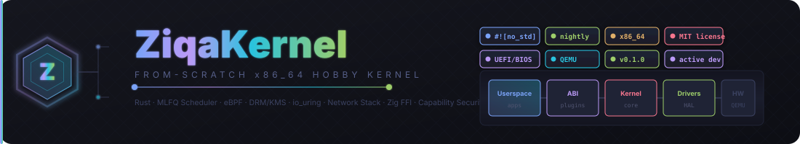
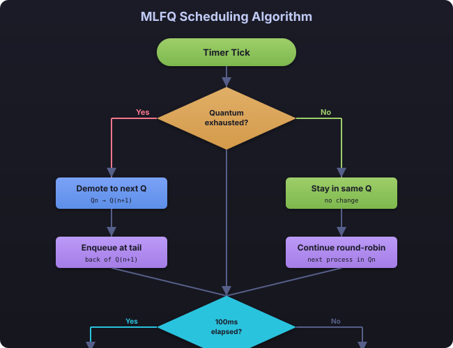
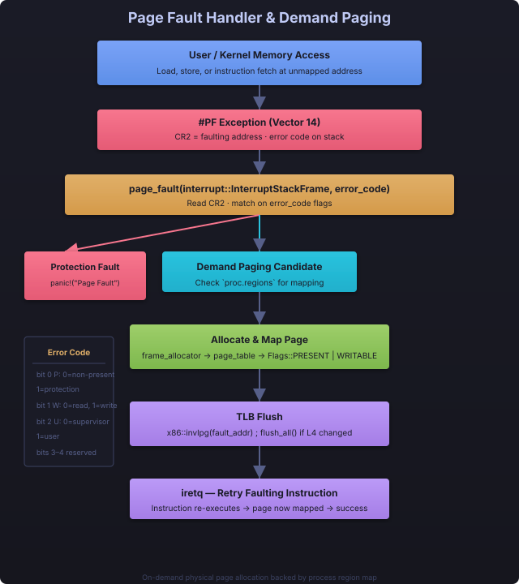
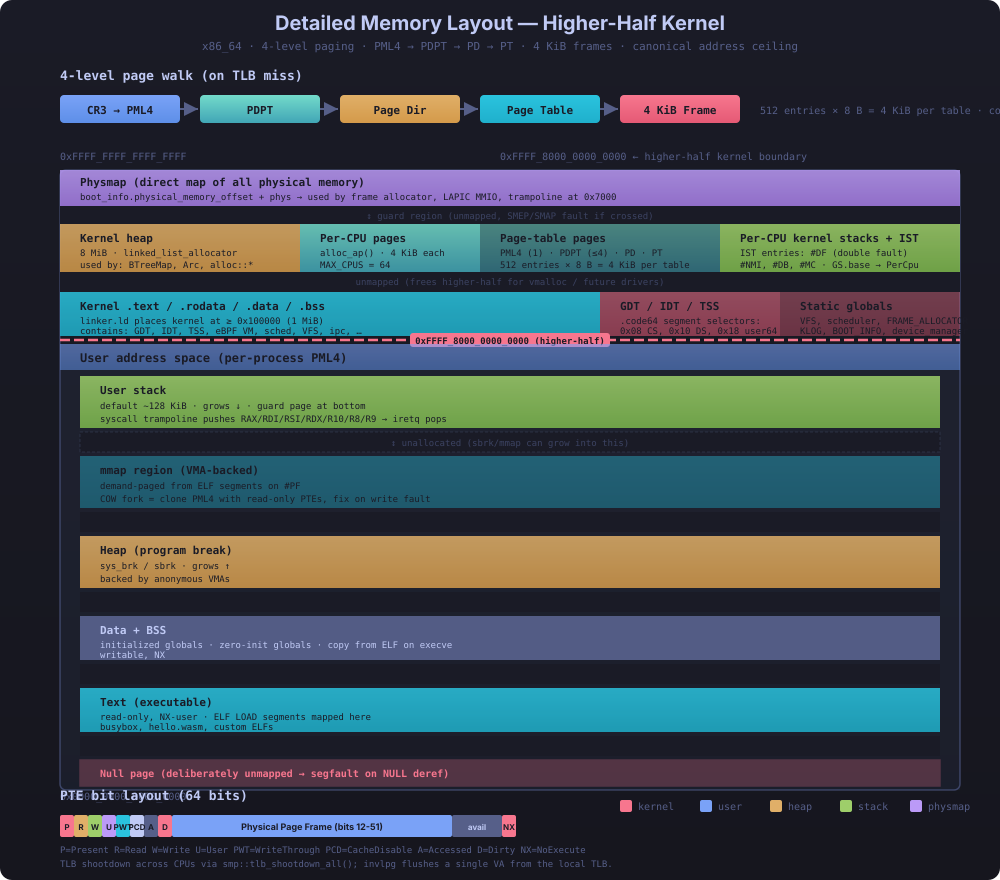

<p align="center">
  
  
  
  
  
</p>

**A from-scratch x86_64 hobby kernel in Rust** — MLFQ scheduler, capability security, Linux ELF + WASM ABI plugins, eBPF, DRM/KMS, network stack, Zig FFI, DOOM fire, Tetris, and more.


> **Status**: Active development · **Language**: Rust nightly · **Target**: x86_64 bare-metal (`#![no_std]`) · **Boot**: BIOS/UEFI via bootloader crate

<div align="center">

[](https://gitpod.io/#https://github.com/YOUR_USER/YOUR_REPO)
[](https://github.com/codespaces/new?repo=YOUR_USER/YOUR_REPO)

</div>

---

## 🎥 Demo

[](https://asciinema.org/a/PLACEHOLDER)

*TODO: Record a demo with `asciinema rec` while running `make run` — PRs welcome!*

---

## Table of Contents

- [🎥 Demo](#-demo)
- [Architecture Overview](#architecture-overview)
- [Subsystems](#subsystems)
  - [x86_64 HAL](#x86_64-hal)
  - [Process Management](#process-management)
  - [MLFQ Scheduler](#mlfq-scheduler)
  - [Memory Management](#memory-management)
  - [Virtual File System](#virtual-file-system)
  - [Network Stack](#network-stack)
  - [eBPF](#ebpf)
  - [DRM/KMS](#drmkms)
  - [io_uring](#iouring)
  - [IPC](#ipc)
  - [Zig FFI & Blitter](#zig-ffi--blitter)
  - [DOOM Fire Effect](#doom-fire-effect)
  - [Tetris](#tetris)
  - [Block Device Interface](#block-device-interface)
- [Project Map](#project-map)
- [Quick Start](#quick-start)
  - [Docker Quick Start](#docker-quick-start)
- [Build Configuration](#build-configuration)
- [Syscall Flow](#syscall-flow)
- [Memory Layout](#memory-layout)
- [Shell Commands](#shell-commands)
- [ABI Plugin Architecture](#abi-plugin-architecture)
- [Capability-Based Security](#capability-based-security)
- [Build Performance](#build-performance)
- [FAQ / Troubleshooting](#faq--troubleshooting)
- [First Steps](#first-steps)
- [Roadmap](#roadmap)
- [Contributing](#contributing)
- [Star History](#star-history)
- [Acknowledgments](#acknowledgments)
- [License](#license)

---

## Architecture Overview


The ZiqaKernel is structured around a modular core, decoupling the kernel from specific ABI implementations. It includes 23+ subsystems spanning process management, memory management, filesystems, networking, eBPF, DRM/KMS, io_uring, IPC, capability security, a Zig FFI blitter, a DOOM fire demo, and a playable Tetris game.


---

## Boot Flow


The boot sequence proceeds from firmware through the bootloader, HAL initialization, memory setup, subsystem init, kernel demos, and finally the interactive shell.

---

## Subsystems

### x86_64 HAL


| File | Key Items |
|------|-----------|
| `gdt.rs` | GDT with kernel code/data segments, user segments, TSS with IST1 for double faults |
| `interrupts.rs` | IDT with 15 exception handlers, timer + keyboard ISRs, int 0x80 syscall gate, PIC initialization, demand-paging page fault handler |

### Process Management

```
 Process ──┬── PID              PID: u64
           ├── State            Created → Ready → Running → Blocked → Exited
           ├── ABI Kind         LinuxElf | Wasm | ZiqaNative
           ├── CPU State        rax, rbx, ..., rip, rflags, cs, ss
           ├── Memory Regions   [Option<MemoryRegion>; 16]
           ├── FD Table         FdTable (16 slots: stdin/out/err + 13, pipe support)
           ├── Capabilities     CapabilitySpace (File, Network, IPC, Memory, CPU)
           ├── Signals          SignalState (32 signals, SignalFrame, user-space delivery)
           ├── cwd              Current working directory (128 bytes)
           ├── brk              Program break for sbrk/brk
           ├── mmap_bump        Bump allocator base for mmap (0x7000_0000)
           ├── binary_data      Raw ELF binary for demand-paging page-fault-on-demand copy
           └── Scheduling       priority 0-3, parent PID
```

| Syscall | Description |
|---------|-------------|
| `spawn` | Create new process with ABI kind, entry point, stack |
| `fork` | Clone process — full copy of regions, CPU state, FDs |
| `exec` | Reset process image — clear regions, new entry, fresh FD table |
| `exit` | Mark as Exited, notify parent via SIGCHLD |
| `waitpid` | Reap zombie child, return (pid, exit_code) |
| `kill` | Send signal to process |
| `signal` | Set signal handler action (default: Terminate/CoreDump/Ignore/Stop/Continue) |

### MLFQ Scheduler




### Memory Management




```
 x86_64 4-Level Paging:

   ┌──────┐      ┌──────┐      ┌──────┐      ┌──────┐
   │ PML4 │─────►│ PDPT │─────►│  PD  │─────►│  PT  │─────► 4KiB Frame
   │ 512  │      │ 512  │      │ 512  │      │ 512  │
   └──────┘      └──────┘      └──────┘      └──────┘
   (CR3)         Page-Dir      Page-Dir       Page Table
                 Pointer       (1 GiB)        (2 MiB)

   Higher-half kernel mapping via physical_memory_offset (BootInfo)

 Components:
 ┌──────────────────┐  ┌──────────────────┐  ┌──────────────────────┐
 │ Frame Allocator   │  │   Heap Allocator  │  │   Demand Paging      │
 │ BootInfo-based   │  │ linked_list_aloc  │  │ Page fault →         │
 │ skips first 512  │  │ 8 MiB backing     │  │ allocate frame       │
 │ usable frames    │  │ spinlock guarded  │  │ copy ELF segment     │
 └──────────────────┘  └──────────────────┘  │ map + flush TLB      │
                                              └──────────────────────┘

**Demand Paging**: The page-fault handler (`interrupts.rs`) checks if the faulting address falls within a registered memory region. If so, it allocates a physical frame from `FRAME_ALLOCATOR`, maps it via `Mapper::map_to()`, and copies the corresponding ELF segment data from the process's `binary_data` field into the newly-mapped page. This enables on-demand loading of ELF segments — only the faulted pages are physically allocated.

```

### Virtual File System


| Feature | Description |
|---------|-------------|
| **VFS** | Global `VFS` instance with path-based file lookup, capability-gated read/write |
| **RamFS** | In-memory filesystem backed by `Arc<Mutex<dyn File>>` |
| **ZiqaFS** | Persistent filesystem on VirtIO block device with superblock metadata |
| **Page Cache** | LRU cache (64 entries × 4 KiB = 256 KiB), thread-safe with spinlock |

### eBPF


`src/ebpf/` — Minimal eBPF implementation with verifier and 11-register VM:

- **Instruction set**: 11 ALU ops (add/sub/mul/div/and/or/xor/lsh/rsh), 6 jump ops (ja/jeq/jne/jgt/jge), RET, MOV
- **Verifier**: Max 4096 instructions, DAG-only (no backward jumps), must contain RET
- **VM**: 11 registers (R0–R10), bounds-checked, division-by-zero safe, relative jump offsets
- **Shell integration**: Demonstrated in boot demos (eBPF program computes 100 + 50 = 150)

### DRM/KMS

`src/drivers/drm.rs` — Direct Rendering Manager stub for Wayland compositor support:

- **Framebuffers**: Create/destroy up to 16 framebuffer objects (configurable width/height/format)
- **Page Flip**: Queue front-buffer switches for vsync
- **Resources**: CRTC and connector enumeration
- **Formats**: XRGB8888, ARGB8888, RGB565
- **Ioctl Routing**: `sys_ioctl` detects DRM commands by `0x64XX` prefix → `handle_ioctl()`

### io_uring

`src/io/uring.rs` — Async I/O rings inspired by Linux io_uring:

```
 ┌──────────────┐     ┌──────────────┐     ┌──────────────┐
 │ Submission   │────►│  Kernel      │────►│ Completion   │
 │ Queue (SQ)   │     │  Process     │     │ Queue (CQ)   │
 │ SqEntry[16]  │     │  SQ entries  │     │ CqEntry[16]  │
 │ NOP/READ/    │     │  in batches  │     │ user_data +  │
 │ WRITE        │     │              │     │ result       │
 └──────────────┘     └──────────────┘     └──────────────┘
```

| Op | Description |
|----|-------------|
| `NOP` | No-op (returns 0) |
| `READ` | VFS-backed read from file descriptor |
| `WRITE` | VFS-backed write to file descriptor |

### IPC


```
 IPC Channels (ring buffer):
 ┌────┐ ┌────┐ ┌────┐ ┌────┐           ┌────┐
 │    │ │    │ │    │ │    │ ●●● ●●● │    │
 └────┘ └────┘ └────┘ └────┘           └────┘
  head                                   tail
  (read)                                 (write)

 • Fixed capacity: 16 messages × 256 bytes each
 • Up to 32 simultaneous channels
 • Blocking semantics via spinlock on ChannelTable

 Shared Memory (ipc/shm.rs):
 • Create segment with size
 • Attach to process virtual address space
 • Detach on process exit
  • Page-aligned backing store
```

### Network Stack

`src/net/mod.rs` — Minimal packet-oriented network abstraction with:

- **NetDevice**: Virtual network device with name, MAC, tx/rx queues, statistics counters
- **Loopback (lo)**: Echoes transmitted packets straight to receive queue for testing
- **PacketQueue**: Fixed-capacity ring buffer (16 packets × MTU=1500)
- **NetStack**: Global device registry (up to 4 devices), `NET` static
- **VirtIO Net driver**: `src/drivers/virtio_net.rs` — VirtIO-net device with VirtQueue descriptor rings for TX/RX

```
  ┌─────────┐     ┌─────────┐     ┌─────────┐
  │  lo     │     │  eth0   │     │  ...    │
  │ loopback│     │ VirtIO  │     │         │
  └────┬────┘     └────┬────┘     └────┬────┘
       │               │               │
       └───────────────┼───────────────┘
                       ▼
              ┌────────────────┐
              │   NetStack     │
              │  NET static    │
              │  (max 4 devs)  │
              └────────────────┘
```

### Zig FFI & Blitter

`src/zig_ffi.rs` — C-ABI bindings to a Zig static library (`src/zig/blitter.zig`) providing high-performance pixel operations:

| Function | Purpose |
|----------|---------|
| `zig_fill_rect` | Fill rectangle with solid color |
| `zig_blit_bitmap` | Copy bitmap region with clipping |
| `zig_scroll_up` | Scroll framebuffer up N lines |
| `zig_clear` | Fast memset on framebuffer |
| `zig_memset32` | 32-bit memset |
| `zig_memcpy` | Memory copy |
| `zig_doom_fire_step` | Propagate + render one DOOM fire frame |
| `zig_doom_fire_to_ascii` | Render fire grid as ASCII art for serial output |

### DOOM Fire Effect

`src/doom.rs` — Classic DOOM fire algorithm on a 80×50 grid:

- **37-color palette**: Near-black → red → orange → yellow → white
- **Dual output**: Serial ASCII (headless) or framebuffer pixels when DRM is active
- **Zig-backed**: The hot-path fire step is accelerated via `zig_doom_fire_step` in the Zig blitter
- **Shell command**: `doom <steps>` runs N iterations (default: 60), prints ASCII frames every 4 steps

```
  Step 0               Step 20              Step 60
  ┌──────────┐        ┌──────────┐        ┌──────────┐
  │          │        │   ▄██▀  │        │ ▄▄▄███▄  │
  │          │   →    │  █████  │   →    │██████████▄│
  │██████████│        │██████████│        │████████████
  └──────────┘        └──────────┘        └──────────┘
```

### Tetris

`src/tetris.rs` — Fully playable graphical Tetris game rendered to the VGA text console (80×25):

- **All 7 standard Tetris pieces**: I, O, T, S, Z, J, L with rotation
- **Board**: 10×20 grid with collision detection and line clearing
- **Scoring**: NES-style (40/100/300/1200 × level), level progression, speed increase
- **Next-piece preview**: Displays upcoming piece with a custom 3×5 bitmap font
- **Game-over**: Red banner overlay, R to restart
- **Controls**: A/L=left, D/R=right, W=rotate, S=soft drop, Q=quit
- **Zig-accelerated**: All rendering uses `zig_fill_rect` and `zig_clear` from the Zig blitter
- **Shell command**: `tetris` launches the game

```
   ┌──────────────────────┐
   │                      │  SCORE: 00400
   │    ████              │  LEVEL: 1
   │       ██             │  LINES: 2
   │       ██             │
   │   ██████             │  NEXT:
   │   ██████             │   ███
   │                      │    █
   └──────────────────────┘
```

### Block Device Interface

`src/drivers/block.rs` — Generic `BlockDevice` trait for disk I/O:

```rust
pub trait BlockDevice: Send + Sync {
    fn read_sectors(&self, sector: u64, count: u32, buf: &mut [u8]) -> Result<(), AbiError>;
    fn write_sectors(&self, sector: u64, count: u32, buf: &[u8]) -> Result<(), AbiError>;
    fn total_sectors(&self) -> u64;
}
```

- **Sector size**: 512 bytes (standard)
- **VirtIO Block**: `src/drivers/virtio_block.rs` — MMIO-based VirtIO block device (2048 sectors)
- **ZiqaFS**: Persisent filesystem stored on VirtIO block device, initialized at boot

---

<details>
<summary><b>Project Map</b> (click to expand)</summary>

```
src/
├── abi/                          # ABI Plugin Architecture
│   ├── linux/                    #   Linux ELF loader + 57 syscall numbers, ~49 handlers
│   │   ├── mod.rs                #   LinuxAbiPlugin, 57 syscall dispatch
│   │   └── elf_loader.rs         #   load_elf(): parse ELF, map PT_LOAD → regions
│   ├── wasm/                     #   WASM runtime stub (WASI ABI detection)
│   │   └── mod.rs
│   ├── mod.rs                    #   AbiPlugin trait + AbiRegistry (4-slot)
│   └── syscall.rs                #   Core dispatcher: GETPID/FORK/MMAP/WAITPID...
├── arch/
│   └── x86_64/                   # HAL — bare-metal x86_64
│       ├── gdt.rs                #   GDT with TSS + IST for double fault
│       ├── interrupts.rs         #   IDT, PIC, exceptions, int 0x80 gate, demand paging PF
│       └── mod.rs
├── capability/                   # Capability-based access control
│   └── mod.rs                    #   CapabilitySpace, ResourceKind, Permissions
├── drivers/
│   ├── block.rs                  #   BlockDevice trait (read/write sectors)
│   ├── drm.rs                    #   DRM/KMS: framebuffer, page flip, ioctls
│   ├── framebuffer.rs            #   Linear framebuffer (8-bit + 32-bit), scroll_up
│   ├── keyboard.rs               #   PS/2 scancode ring buffer
│   ├── uart.rs                   #   16550 serial port
│   ├── vga.rs                    #   VGA text mode (80×25, 16 colors), Unicode→CP437 mapper
│   ├── virtio_block.rs           #   VirtIO block (MMIO, 2048-sector)
│   └── virtio_net.rs             #   VirtIO-net: VirtQueue descriptor rings (commented out)
├── ebpf/
│   ├── mod.rs                    #   BPF instruction opcodes (11 ALU, 6 JMP, RET, MOV)
│   ├── verifier.rs               #   Pre-execution validator (4096 max, DAG-only, no backward jumps)
│   └── vm.rs                     #   11-register VM interpreter
├── fs/
│   ├── mod.rs                    #   File trait (read/write/file_type/size)
│   ├── vfs.rs                    #   Capability-gated VFS with mount/lookup
│   ├── ramfs.rs                  #   In-memory file (Mountable)
│   ├── ziqafs.rs                 #   Persistent FS on VirtIO block (inode-based, 4KB blocks)
│   └── pagecache.rs              #   LRU page cache (64 entries)
├── io/
│   └── uring.rs                  #   Async I/O rings (SQ/CQ, NOP/READ/WRITE ops)
├── ipc/
│   ├── mod.rs                    #   Message channels (ring buffer, 16 msg × 256 B)
│   ├── shm.rs                    #   Shared memory segments (up to 4 frames = 16 KB)
│   └── signal.rs                 #   Signal queue (bitmask pending, Kill/Stop/Continue/Usr1/Usr2)
├── memory/
│   ├── mod.rs                    #   FRAME_ALLOCATOR, PAGE_SIZE, re-exports
│   ├── paging.rs                 #   MemoryMapper, KERNEL_MAPPER, AddressSpace, MemoryRegion
│   ├── heap.rs                   #   linked_list_allocator (8 MiB, spinlock)
│   ├── heapstats.rs              #   Allocation tracking (allocs, frees, peak, fragmentation)
│   └── frame_allocator.rs        #   BootInfoFrameAllocator (BIOS memory map, skips first 512 frames)
├── net/
│   └── mod.rs                    #   Packet-oriented net: NetStack, NetDevice, loopback, stats
├── process/
│   ├── mod.rs                    #   Process, CpuState, FdTable (16 slots + pipe), Pid, mmap_bump, binary_data
│   ├── scheduler.rs              #   MLFQ: spawn/fork/exec/waitpid/exit/kill/send_signal, spawn_elf
│   └── signal.rs                 #   SignalState (32 signals), SignalFrame, user-space delivery
├── shell.rs                      #   Interactive shell (16 commands: help → tetris)
├── timer.rs                      #   PIT (100 Hz), tick counter, sleep queue (32 entries)
├── klog.rs                       #   Ring-buffer kernel log (256 entries, 4 levels)
├── perf.rs                       #   Benchmark suite + RDTSC cycle measurements
├── tests.rs                      #   Kernel self-tests (39 tests: sched, ABI, memory, caps, FdTable, pipe, net)
├── doom.rs                       #   DOOM fire algorithm (80×50, Zig-accelerated)
├── tetris.rs                     #   Playable Tetris game (VGA console, Zig-accelerated rendering)
├── zig_ffi.rs                    #   C-ABI bindings to Zig blitter (8 functions: fill, blit, scroll, clear, memset, memcpy, fire, to_ascii)
├── lib.rs                        #   Crate root: 23 modules, init(), ABI registry
└── main.rs                       #   Entry: kernel_main, banner, boot sequence with 4 phases + auto-exec ELF
```

</details>

---

## Quick Start

### Prerequisites

```bash
# Rust nightly + target
rustup toolchain install nightly
rustup component add rust-src llvm-tools-preview
rustup target add x86_64-unknown-none

# bootimage tool
cargo install bootimage

# QEMU emulator
# Debian/Ubuntu:
sudo apt install qemu-system-x86_64
# Fedora:
sudo dnf install qemu-system-x86
# Arch:
sudo pacman -S qemu-system-x86_64
```

### Build & Run

```bash
# Build and run with defaults
make

# Run in QEMU (serial console)
make run

# Fast incremental build
make inc

# Release build (optimized)
make release

# Using cargo directly
cargo build
cargo run

# Bootable image (for bare-metal or USB)
make boot
```

### QEMU Display Options

```bash
# Serial console only (default)
qemu-system-x86_64 -drive format=raw,file=target/x86_64-unknown-none/debug/ziqa-kernel -serial stdio -display none

# Graphics mode (VGA/SDL)
qemu-system-x86_64 -drive format=raw,file=target/x86_64-unknown-none/debug/ziqa-kernel -serial stdio -display sdl

# GDB debugging (port 1234)
qemu-system-x86_64 -s -S -drive format=raw,file=target/x86_64-unknown-none/debug/ziqa-kernel -serial stdio -display none
# In another terminal:
gdb target/x86_64-unknown-none/debug/ziqa-kernel -ex "target remote :1234"
```

### Makefile Targets

| Target | Command | Description |
|--------|---------|-------------|
| `default` | `make` | Debug build |
| `build` | `make build` | Build kernel ELF |
| `run` | `make run` | Build + QEMU (SDL display) |
| `release` | `make release` | Optimized build (-O3) |
| `clean` | `make clean` | Remove `target/` |
| `inc` | `make inc` | Incremental rebuild |
| `fast` | `make fast` | Build with `-j $(nproc)` |
| `boot` | `make boot` | Create bootable image |
| `test` | `make test` | Run tests (via cargo) |

### Docker Quick Start

```bash
# Build the kernel using Docker
docker compose build

# Run in QEMU (headless, serial console)
docker compose run run-headless

# Interactive dev environment with all tools installed
docker compose run dev

# Build with graphics output (requires X11 on host)
docker compose run run
```
---

<details>
<summary><b>Build Configuration</b> (click to expand)</summary>

### Rust Toolchain (`rust-toolchain.toml`)

```toml
[toolchain]
channel = "nightly"
components = ["rust-src", "llvm-tools-preview"]
targets = ["x86_64-unknown-none"]
```

### Target Spec (`x86_64-unknown-none.json`)

```json
{
  "llvm-target": "x86_64-unknown-none-elf",
  "cpu": "x86-64",
  "code-model": "kernel",
  "disable-redzone": true,
  "features": "-mmx,-sse,-sse2,-sse3,-ssse3,-sse4.1,-sse4.2,-avx,-avx2,+soft-float",
  "linker-flavor": "gnu-lld",
  "linker": "lld",
  "max-atomic-width": 64
}
```

### Cargo Config (`.cargo/config.toml`)

```toml
[build]
target = "x86_64-unknown-none"
jobs = 8

[target.'cfg(target_os = "none")']
runner = "bootimage runner"

[unstable]
build-std = ["core", "compiler_builtins", "alloc"]
build-std-features = ["compiler-builtins-mem"]
```

### Dependencies

| Crate | Version | Purpose |
|-------|---------|---------|
| `bootloader` | 0.9 | BIOS/UEFI boot, `map_physical_memory` |
| `x86_64` | 0.14 | Page tables, port I/O, MSRs, GDT/IDT |
| `spin` | 0.9 | `Mutex` (no OS required) |
| `lazy_static` | 1.4 | Lazy statics with `spin_no_std` |
| `linked_list_allocator` | 0.10 | Kernel heap with `use_spin` |
| `pic8259` | 0.10 | 8259 PIC driver |
| `uart_16550` | 0.3 | Serial port |
| `pc-keyboard` | 0.7 | PS/2 scancode decoding |
| `volatile` | 0.2 | MMIO volatile access |

</details>

---

## Syscall Flow


```
 User Process                    Kernel                           ABI Plugin
 ────────────                    ──────                           ──────────
      │                             │
      │  mov rax, SYS_GETPID        │
      │  int 0x80                   │
      │────────────────────────────►│
      │                             │
      │                    ┌────────┴────────┐
      │                    │ syscall_handler() │
      │                    │ (interrupt gate)  │
      │                    └────────┬────────┘
      │                             │
      │                    ┌────────┴────────┐
      │                    │ dispatch_syscall()│
      │                    │ registry, ctx     │
      │                    └────────┬────────┘
      │                             │
      │                    ┌────────┴────────┐
      │                    │  match ctx.num   │
      │                    │  ┌────────────┐  │
      │                    │  │ Core?      │──┼──► return direct
      │                    │  │ GETPID/EXIT│  │
      │                    │  │ FORK/MMAP  │  │
      │                    │  └────────────┘  │
      │                    │  ┌────────────┐  │
      │                    │  │ ABI?       │──┼──► plugin.handle_syscall()
      │                    │  │ write/read │  │      │
      │                    │  │ open/brk   │  │      │
      │                    │  └────────────┘  │      │
      │                    └─────────────────┘      │
      │                             │               │
      │  RAX = result               │               │
      │◄────────────────────────────┼───────────────┤
      │  iretq                      │               │
```

<details>
<summary><b>Syscall Reference</b> (click to expand — 57 syscall numbers, ~49 implemented)</summary>

| Number | Name | Description | Handler |
|--------|------|-------------|---------|
| 0 | `READ` | Read from fd (pipe/stdin) | Linux ABI |
| 1 | `WRITE` | Write to fd (stdout/pipe) | Core + ABI |
| 2 | `OPEN` | Open file → alloc fd | Linux ABI |
| 3 | `CLOSE` | Close fd | Linux ABI |
| 5 | `FSTAT` | File stat | Linux ABI |
| 7 | `POLL` | Poll fds (delegates to select) | Linux ABI |
| 8 | `LSEEK` | Seek on fd | Linux ABI |
| 9 | `MMAP` | Map memory region (bump or MAP_FIXED) | Core |
| 11 | `MUNMAP` | Unmap region | Core |
| 12 | `BRK` | Set program break | Linux ABI |
| 13 | `RT_SIGACTION` | Set signal handler | Linux ABI |
| 14 | `RT_SIGPROCMASK` | Set signal mask (stub) | Linux ABI |
| 16 | `IOCTL` | Device ioctl (DRM routing) | Linux ABI |
| 17 | `PREAD64` | Positional read | Linux ABI |
| 19 | `READV` | Scatter-gather read | Linux ABI |
| 20 | `WRITEV` | Gather write | Linux ABI |
| 21 | `ACCESS` | File access check | Linux ABI |
| 22 | `PIPE` | Create pipe | Linux ABI |
| 23 | `SELECT` | Select fds (stub) | Linux ABI |
| 24 | `SCHED_YIELD` | Yield CPU | Core |
| 32 | `DUP` | Duplicate fd | Linux ABI |
| 33 | `DUP2` | Duplicate to specific fd | Linux ABI |
| 35 | `NANOSLEEP` | Sleep ms (PIT-based) | Core + ABI |
| 39 | `GETPID` | Get process ID | Core |
| 41 | `SOCKET` | Create socket (fake fd) | Linux ABI |
| 42 | `CONNECT` | Connect socket (returns -ECONNREFUSED) | Linux ABI |
| 43 | `ACCEPT` | Accept connection (returns -EAGAIN) | Linux ABI |
| 44 | `SENDTO` | Send (stub) | Linux ABI |
| 45 | `RECVFROM` | Receive (returns -EAGAIN) | Linux ABI |
| 49 | `BIND` | Bind socket (stub OK) | Linux ABI |
| 50 | `LISTEN` | Listen (stub OK) | Linux ABI |
| 54 | `SETSOCKOPT` | Set socket option (stub OK) | Linux ABI |
| 55 | `GETSOCKOPT` | Get socket option (stub OK) | Linux ABI |
| 56 | `CLONE` | Fork fallback | Linux ABI |
| 57 | `FORK` | Fork process | Core |
| 59 | `EXECVE` | Exec process | Linux ABI |
| 60 | `EXIT` | Exit process | Core |
| 61 | `WAITPID` | Wait for child | Core |
| 62 | `KILL` | Send signal | Core |
| 63 | `UNAME` | System info | Linux ABI |
| 72 | `FCNTL` | File control (F_DUPFD, F_GETFD/SETFD, etc.) | Linux ABI |
| 79 | `GETCWD` | Get working dir | Linux ABI |
| 80 | `CHDIR` | Change directory | Linux ABI |
| 89 | `READLINK` | Read symlink (/proc/self/exe) | Linux ABI |
| 102 | `GETUID` | Get user ID (returns 0) | Linux ABI |
| 103 | `GETGID` | Get group ID (returns 0) | Linux ABI |
| 104 | `GETEUID` | Get effective UID (returns 0) | Linux ABI |
| 105 | `GETEGID` | Get effective GID (returns 0) | Linux ABI |
| 110 | `GETPPID` | Get parent PID | Core |
| 114 | `WAIT4` | waitpid variant | Linux ABI |
| 158 | `ARCH_PRCTL` | Arch-specific (TLS) | Linux ABI |
| 186 | `GETTID` | Get thread ID (returns pid) | Linux ABI |
| 202 | `FUTEX` | Fast user-space mutex (WAIT/WAKE stubs) | Linux ABI |
| 218 | `SET_TID_ADDR` | Set TID address | Linux ABI |
| 230 | `CLOCK_NANOSLEEP` | High-res sleep (delegates to NANOSLEEP) | Core |
| 231 | `EXIT_GROUP` | Exit thread group | Core |
| 234 | `TGKILL` | Thread-group kill | Linux ABI |
| 257 | `OPENAT` | Open relative to dirfd | Linux ABI |

</details>

---

## Memory Layout



---

## Shell Commands

| Command | Description |
|---------|-------------|
| `help` | Show available commands |
| `uptime` | Kernel uptime (ms/s/ticks) |
| `ps` | List all processes (PID, state, priority, ABI) |
| `spawn [path]` | Spawn a skeleton process (or from VFS path) |
| `spawnelf <path>` | Spawn process from VFS ELF binary (uses `spawn_elf` + `elf_loader`) |
| `exec <pid>` | Execute process entry point (runs in kernel) |
| `kill <pid> [sig]` | Send signal (default SIGTERM=15) |
| `sleep <ms>` | Block shell for N milliseconds |
| `meminfo` | Heap: start, size, allocs, frees, current/peak usage |
| `netstat` | Network device statistics (tx/rx packets/bytes) |
| `klog [level]` | Dump kernel log (debug/info/error) |
| `doom [steps]` | Run DOOM fire demo (Zig-accelerated, default 60) |
| `tetris` | Launch graphical Tetris game (VGA console) |
| `reboot` | Reboot via PS2 controller port 0x64 |
| `echo <text>` | Print text to serial |
| `clear` | Clear screen (25 newlines) |

---

## ABI Plugin Architecture

ZiqaKernel decouples **process ABI** from **kernel core** via a plugin system:

```rust
pub trait AbiPlugin: Send + Sync {
    fn name(&self) -> &'static str;
    fn kind(&self) -> AbiKind;                          // LinuxElf | Wasm | ZiqaNative
    fn can_load(&self, binary: &[u8]) -> bool;          // magic check
    fn load(&self, binary: &[u8], proc: &mut Process)   // map binary → regions
        -> Result<(), AbiError>;
    fn handle_syscall(&self, ctx: &mut SyscallContext)   // dispatch ABI syscalls
        -> Result<u64, AbiError>;
}
```

```
 Binary Load Flow:

   ┌──────────┐     can_load()     ┌──────────┐
   │  ELF Bin │──────────────────► │  Linux   │
   │ 0x7f ELF │     magic check    │  Plugin  │
   └──────────┘                    └────┬─────┘
                                        │
                          ┌─────────────┴─────────────┐
                          │  elf_loader::load_elf()    │
                          │                           │
                          │  1. Parse ELF header       │
                          │  2. Iterate PT_LOAD segments│
                          │  3. For each segment:      │
                          │     a. Create MemoryRegion  │
                          │     b. proc.add_region()   │
                          │  4. Set proc.entry_point   │
                          │  5. Set proc.abi = LinuxElf │
                          └─────────────────────────────┘
                                        │
                                        ▼
                                  ┌──────────┐
                                  │ Process  │
                                  │ ready to │
                                  │ schedule │
                                  └──────────┘
```

### Registered Plugins

| Plugin | `can_load` | `load` | Syscalls |
|:-------|------------|--------|----------|
| **LinuxAbiPlugin** | `b"\x7fELF"` | `elf_loader::load_elf()` | 57 syscall numbers defined / ~49 handlers: write, read, open, close, mmap, munmap, brk, dup, dup2, pipe, getcwd, chdir, exit, exit_group, kill, tgkill, waitpid, wait4, nanosleep, clock_nanosleep, uname, fstat, lseek, ioctl (DRM routing), writev, readv, pread64, access, select, poll, futex, clone, getpid, getppid, gettid, set_tid_address, arch_prctl, getuid, getgid, geteuid, getegid, socket, bind, connect, listen, accept, sendto, recvfrom, setsockopt, getsockopt, readlink, fcntl, openat, sched_yield, sigaction, sigprocmask |
| **WasmAbiPlugin** | `b"\x00asm"` | stub (prints only) | 2 handlers: fd_write, proc_exit |

---

## Capability-Based Security


---

## Build Performance

| Metric | Value |
|--------|-------|
| Clean build | ~50-120s |
| Incremental build | ~1.7-2s |
| Release build | ~60s |
| Codegen units | 16 (parallel) |
| Build jobs | 8 |
| Dev optimization | `opt-level = 1` |
| Dependencies opt | `opt-level = 0` |
| Linker | `lld` |
| Panic strategy | `abort` |

---

## Roadmap

### Short Term
- [x] Signal delivery and handling (SIGKILL, SIGTERM, SIGCHLD, SIGUSR1/2)
- [x] VFS-backed exec (`spawnelf <path>` from shell)
- [x] Network loopback device with packet queues and stats
- [x] DOOM fire demo with Zig-accelerated rendering
- [x] Tetris game (fully playable on VGA console)
- [x] fork, waitpid, mmap, munmap syscalls (core dispatcher)
- [x] Demand paging (page fault → allocate frame → copy ELF segment)
- [x] spawn_elf: spawn process from ELF binary in kernel space
- [x] FdTable with pipe support (10 tests)
- [ ] Full Linux syscall compatibility (50+/100+ syscalls)

### Medium Term
- [ ] Copy-on-write for fork (shared pages → page fault → copy)
- [ ] SMP / multi-core (APIC, IPI, per-CPU run queues)
- [ ] ext2/4 filesystem driver
- [x] Ethernet driver (VirtIO-net: VirtQueue descriptor rings, TX/RX — commented out)
- [ ] RTL8139 / e1000 driver
- [ ] TCP/IP stack via smoltcp
- [ ] Real WASM runtime (wasm3 / wasmtime)

### Long Term
- [ ] USB host controller (xHCI)
- [ ] Wayland compositor running natively on ZiqaKernel
- [ ] Userspace environment (busybox, bash, doom)
- [ ] Self-hosting Rust compiler
- [ ] CHERI capability hardware extensions
- [ ] Orthogonal persistence (kernel state survives reboot)

---

## FAQ / Troubleshooting

| Problem | Likely Cause | Fix |
|---------|-------------|-----|
| `rustup` can't find nightly | Toolchain not installed | `rustup toolchain install nightly` |
| `cargo bootimage` fails | bootimage not installed | `cargo install bootimage` |
| QEMU `command not found` | QEMU not installed | `sudo apt install qemu-system-x86_64` |
| Linker errors with `lld` | lld missing | `sudo apt install lld` |
| Kernel panics on boot | Outdated bootloader crate | `cargo update -p bootloader` |
| Build takes too long | First build | Run `make inc` for subsequent builds |
| Serial output garbled | Wrong terminal settings | Use `stty sane` before `make run` |

## First Steps

After building and running the kernel, try these commands at the shell:

```
> help                  # list available commands
> ps                    # show running processes
> meminfo               # inspect heap usage
> spawn                 # spawn a skeleton Linux ELF process
> sleep 1000            # block for 1 second
> klog                  # dump kernel log
> netstat               # show loopback device stats
> doom 60               # run DOOM fire animation
> tetris                # launch graphical Tetris game
> spawnelf test         # spawn ELF from /bin/test
> echo Hello, ZiqaKernel!
> reboot                # reboot the VM
```

**Minimal ELF loader demo** — the smallest possible userspace interaction:

```rust
// This runs inside the kernel: spawn an ELF with int 0x80 syscalls
// See src/tests.rs for the full test suite.
let pid = sys_spawn(AbiKind::LinuxElf, entry, stack);
sys_waitpid(pid, &mut exit_code);
kprintln!("Child {} exited with code {}", pid, exit_code);
```

## Contributing

Contributions are welcome! Here's how to get started:

1. **Fork** the repo and create a feature branch.
2. **Run the tests**: `make test`
3. **Format your code**: `rustfmt` is preferred (run on changed files).
4. **Open a PR** with a clear description of the change.

### Guidelines

- Keep `#![no_std]` — no libstd dependencies in kernel code.
- Document unsafe blocks with a safety comment.
- Match the existing code style (4-space indent, avoid `expect()` in kernel code).
- Add tests in `src/tests.rs` for new subsystems.

### Ideas for First PRs

- Add a missing syscall handler (see Roadmap).
- Implement a new shell command.
- Fix a TODO or FIXME in the source.
- Write documentation or improve these README diagrams.

## Star History

[](https://star-history.com/#YOUR_USER/YOUR_REPO)

## Acknowledgments

- **[Philipp Oppermann's blog](https://os.phil-opp.com)** — The definitive "Writing an OS in Rust" series, which inspired this project's foundation.
- **[OSDev Wiki](https://wiki.osdev.org)** — Invaluable reference for x86_64, ACPI, PCI, and hardware interfaces.
- **Linux kernel source** — Reference for syscall semantics, ELF loading, and MLFQ scheduling.
- **Rust community** — `#osdev` on Discord and the Rust OSDev GitHub organization.

---

## License

MIT — free to use, modify, and distribute.

---

*ZiqaKernel — from scratch, for learning. Built with Rust and curiosity.*
